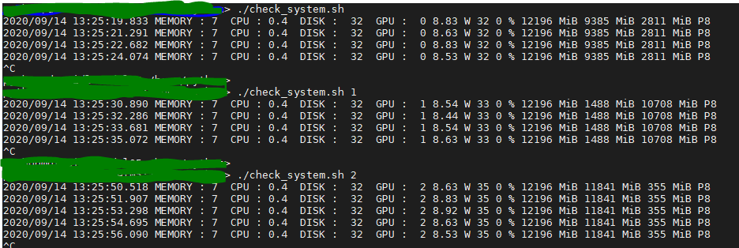

# check_system.sh
OS : Ubuntu 18.04
GPU : nvidia gpu
check_system.sh is monitoring shell program for usage of memory, cpu, disk. and GPU on console or terminal(black-screen) 

### Usage  : ./check_system.sh [GPU NUMBER(Default 0)]
### Output :
#### timestamp MEMORY : memory_Utilization(%) CPU : cpu_Utilization(%) DISK : disk_Utilization(%) gpu_index power(W) temperature gpu_utilization gpu_total_memory, gpu_free_memory gpu_used_memory pstate

bandicam 2020-09-13 16-34-51-330.mp4 is check_system.sh running sample video.